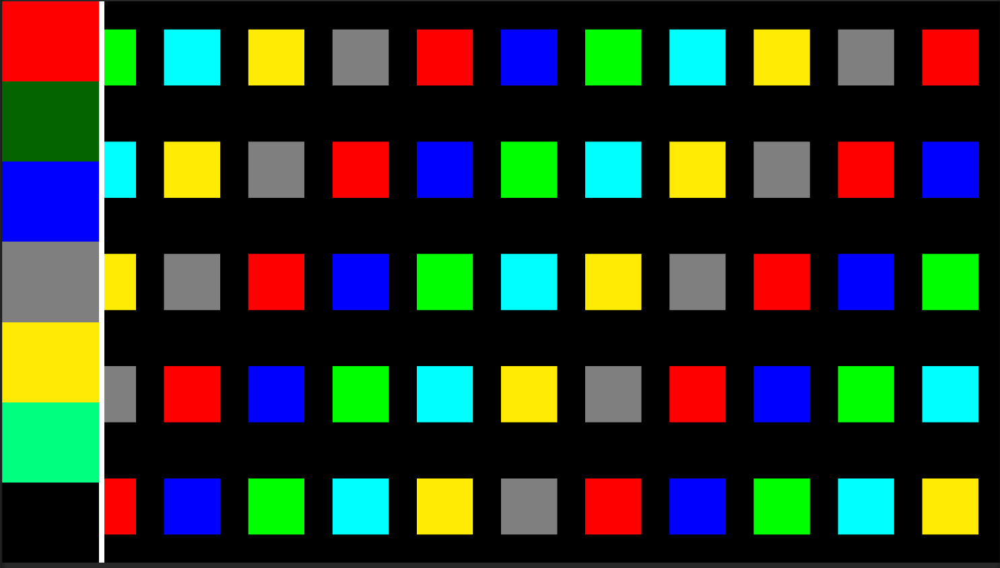

TypicalColors
===
画像の特徴色を簡易的に抽出する

## 抽出手順
画像のRGBをHSVに変換し、`Vector3`型に格納する。  
HSV空間をk-means++でクラスタリングし、各クラスタのセントロイドを特徴色としている。

CPUで計算しているため、リアルタイム向きではない。  
Unityのメインスレッド外、ワーカースレッドでも動作するように実装されている。

 

